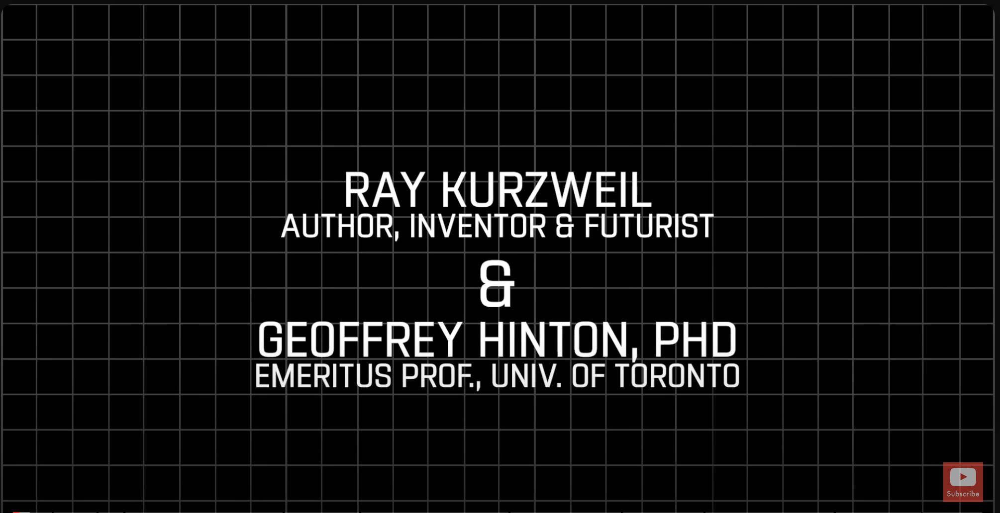

# AI Video Transcriber

In this project, we will perform a transcription from a YouTube video as an example of text extraction from a video, so that we can then ask questions to an LLM about it or create a list of bullet points. This methodology could easily be extended to transcription and summarization from Google Meet or Zoom meetings.

We'll use the video of Ray Kurzweil and Geoff Hinton Debate the Future of AI.

Ray Kurzweil, an American inventor and futurist, is a pioneer in artificial intelligence. He has contributed significantly to OCR, text-to-speech, and speech recognition technologies. He is the author of numerous books on AI and the future of technology and has received the National Medal of Technology and Innovation, among other honors. At Google, Kurzweil focuses on machine learning and language processing, driving advancements in technology and human potential.

Geoffrey Hinton, often referred to as the "godfather of deep learning," is a British-Canadian cognitive psychologist and computer scientist recognized for his pioneering work in artificial neural networks. His research on neural networks, deep learning, and machine learning has significantly impacted the development of algorithms that can perform complex tasks such as image and speech recognition.


[](https://www.youtube.com/watch?v=kCre83853TM)


### Technologies used

+ [LangChain](https://www.langchain.com/)
+ [OpenAI GPT4](https://openai.com/)
+ [Whisper](https://openai.com/research/whisper)


### How to use this repo

First, we need to store the OpenAI API KEY in a `.env` file to load it with the dotenv library and use it as an environment variable. In `notebooks` folder there is a jupyter notebook with a step by step explanation. In `src` folder there are the python codes for creating Chroma database and getting a chat response, besides requirements.txt file. Use examples:

**Creating transcription from Youtube**
```bash
python transcribe.py -u https://www.youtube.com/watch\?v\=60cYUO2bPO8 -q "What are the main topics?"
```

